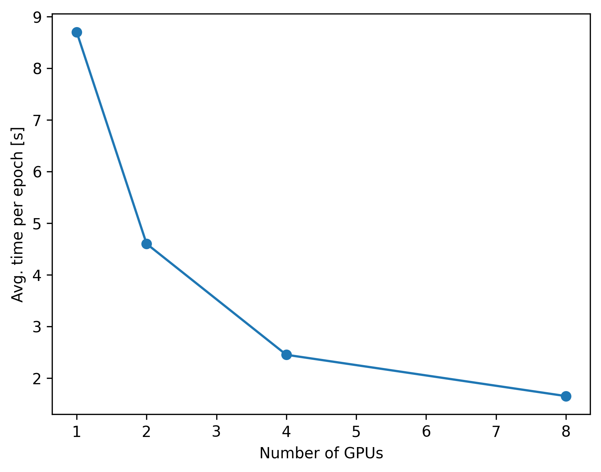

# GPU parallelization

This shows an example on how to run Variational Inference (VI) using multiple GPUs to sample from the model in parallel. We will use the SIR model as an example (see the SIR examples in the VI section).

The full example script can be found in `examples/variational_inference/05-gpu_parallelisation.py`.

To achieve multi-gpu parallelization, we use MPI4PY to launch multiple python processes. The main process (rank 0) is in charge of sampling the parameters that need to be evaluated and updating the candidate posterior parameters. The worker processes only job is to receive the parameters from the main process and to run the evaluate the model on them.

Each process needs to allocate the model in the desired GPU. As you may have already seen from the examples section, all the example models accept a `device` argument that let's us specify the device in the usual torch syntax. So, we initialize the model and the flow in the device we want:

```python
def make_model(n_agents, n_timesteps, device):
    graph = networkx.watts_strogatz_graph(n_agents, 10, 0.1)
    return SIR(graph=graph, n_timesteps=n_timesteps, device=device)


def make_flow(device):
    # Define flows
    torch.manual_seed(0)
    K = 4
    latent_size = 3
    hidden_units = 64
    hidden_layers = 2

    flows = []
    for _ in range(K):
        flows += [
            nf.flows.AutoregressiveRationalQuadraticSpline(
                latent_size, hidden_layers, hidden_units
            )
        ]
        flows += [nf.flows.LULinearPermute(latent_size)]

    # Set prior and q0
    q0 = nf.distributions.DiagGaussian(3, trainable=False)

    # Construct flow model
    flow = nf.NormalizingFlow(q0=q0, flows=flows)
    return flow.to(device)
```

The loss callable that VI takes can be written as

```python
class L2Loss:
    def __init__(self, model):
        self.model = model
        self.loss_fn = torch.nn.MSELoss()

    def __call__(self, params, data):
        observed_outputs = simulate_and_observe_model(
            self.model, params, gradient_horizon=0
        )
        return self.loss_fn(observed_outputs[0], data[0])
```

and we can just setup the training like this

```python
def train_flow(flow, model, true_data, n_epochs, n_samples_per_epoch, device):
    torch.manual_seed(0)
    # Define a prior
    prior = torch.distributions.MultivariateNormal(
        -2.0 * torch.ones(3, device=device), torch.eye(3, device=device)
    )

    optimizer = torch.optim.AdamW(flow.parameters(), lr=1e-3)

    # We set the regularisation weight to 10.
    w = 100

    loss = L2Loss(model)
    # Note that we can track the progress of the training by using tensorboard.
    # tensorboard --logdir=runs
    vi = VI(
        loss=loss,
        posterior_estimator=flow,
        prior=prior,
        optimizer=optimizer,
        w=w,
        n_samples_per_epoch=n_samples_per_epoch,
        device=device,
    )

    # and we run for 500 epochs without early stopping.
    vi.run(true_data, n_epochs=n_epochs, max_epochs_without_improvement=np.inf)
```

Now the script needs to be set so that each core runs on a different device. One way to achieve is to pass the available devices through cli arguments:

```python
if __name__ == "__main__":
    import argparse

    from blackbirds.mpi_setup import mpi_rank

    # parse arguments from cli
    parser = argparse.ArgumentParser()
    parser.add_argument("--n_epochs", type=int, default=500)
    parser.add_argument("--n_agents", type=int, default=5000)
    parser.add_argument("--n_timesteps", type=int, default=100)
    parser.add_argument("--n_samples_per_epoch", type=int, default=5)
    parser.add_argument("--device_ids", default=["cpu"], nargs="+")
    args = parser.parse_args()

    # device of this rank
    device = args.device_ids[mpi_rank]

    model = make_model(args.n_agents, args.n_timesteps, device)
    true_parameters = torch.tensor(
        [0.05, 0.05, 0.05], device=device
    ).log10()  # SIR takes log parameters
    true_data = model.run_and_observe(true_parameters)
    flow = make_flow(device)
    train_flow(
        flow, model, true_data, args.n_epochs, args.n_samples_per_epoch, device=device
    )
```

So we can just run the script by doing

```bash
mpirun -np 5 python examples/variational_inference/05-gpu_parallelisation.py --device_ids cuda:0 cuda:1 cuda:2 cuda:3 cuda:4 --n_samples_per_epoch 20
```

In this case, we will use 5 GPUs, indexed by the ids we pass. Each GPU will execute 4 evaluations of the model for a total of 20. We can plot the scaling with number of GPUs for this particular model:



The GPUs used are 8x Tesla V100 32GB.